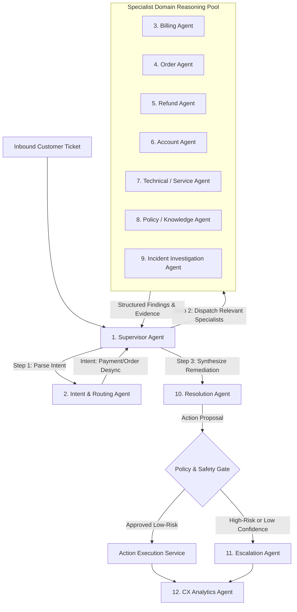

# ResolveX — AI Orchestration & Multi-Agent Architecture
## Specialist Reasoning Workflows & Supervisor Specifications

---

### 1. ORCHESTRATION PHILOSOPHY & SUPERVISOR PATTERN

In ResolveX, AI agents are **not** independent conversational chatbots, nor are they chatty personas in a group text. They are specialized, functional reasoning components governed by a centralized **Supervisor Agent** orchestrated via **LangGraph**.

#### Supervisor Execution Loop:
1. **Context Evaluation:** Supervisor receives the initial `CaseContext`.
2. **Selective Specialist Dispatch:** Dispatches *only* the specialists necessary for the determined intent (e.g., for missing order with paid receipt, it dispatches Billing, Order, and Technical Service agents; it does *not* invoke Account or Subscription agents).
3. **Evidence Reconciliation:** Aggregates findings, evaluates confidence, and updates `CaseContext.agent_findings`.
4. **Resolution or Escalation:** Evaluates if sufficient evidence exists to solve the case deterministically or if an operational incident must be declared.

---

### 2. DE-DUPLICATION & RESPONSIBILITY CONSOLIDATION

To avoid artificial bloat and overlapping agents, responsibilities have been strictly consolidated:
- **Payment, Invoicing & Gateway Verification** are unified inside the **Billing Agent** (eliminating separate "Invoice Agent" or "Card Agent").
- **Fulfillment, Inventory, Shipping & Tracking** are consolidated inside the **Order Agent** (eliminating separate "Shipping Agent" or "Carrier Agent").
- **Infrastructure, Webhooks & Server Telemetry** are consolidated inside the **Technical / Service Agent** (eliminating separate "DevOps Agent" or "Log Agent").
- **Incident Clustering & Blast Radius Estimation** are consolidated in the **Incident Investigation Agent**.

---

### 3. DETAILED SPECIFICATIONS FOR THE 12 SPECIALIST AGENTS

---

#### 1. Supervisor / Orchestrator Agent
- **Responsibility:** High-level case workflow director. Plans the investigation path, schedules specialist invocations, prevents infinite cycles, and coordinates final resolution.
- **Why It Exists:** Prevents chaos and uncontrolled peer-to-peer agent chatter; enforces systematic investigation.
- **Inputs:** Current `CaseContext`.
- **Outputs:** `InvestigationPlan` (list of target specialists and sequence).
- **Evidence Requirements:** Evaluates whether findings from specialists contain valid evidence references before marking a case solved.
- **Confidence Requirements:** Overall confidence is the weighted harmonic mean of specialist confidence scores. Threshold: $\ge 0.80$ to auto-resolve.
- **Tools:** `invoke_specialist(agent_name)`, `evaluate_termination_condition()`, `trigger_resolution()`.
- **What It Must NOT Do:** Must not perform domain queries directly; must not execute actions.
- **Decision Boundaries:** Governs execution flow and halts agent loops after max 4 iterations.
- **Failure Behavior:** If a specialist fails or times out, marks specialist as `DEGRADED` and attempts alternative path.
- **Human-in-the-Loop:** Automatically escalates if loop count exceeds limits or confidence degrades below 0.70.

---

#### 2. Intent & Routing Agent
- **Responsibility:** Ingests raw customer text and attachments; classifies primary intent, secondary intents, urgency, and customer sentiment polarity.
- **Why It Exists:** Rapid front-door triage to route the ticket to the exact specialist path needed without running full database queries.
- **Inputs:** Customer ticket message string, customer ticket subject, initial metadata.
- **Outputs:** `IntentClassification` (`primary_intent`, `urgency`, `sentiment`, `extracted_entities`).
- **Evidence Requirements:** Quotations from customer message highlighting keywords (e.g., "charged my card", "no confirmation email").
- **Confidence Requirements:** $\ge 0.85$ for automated routing; otherwise routed to General Triage.
- **Tools:** None (pure semantic classification using Gemini 2.0 Flash structured outputs).
- **What It Must NOT Do:** Must not make assumptions about actual database records or confirm whether customer claims are true.
- **Decision Boundaries:** Classifies only linguistic intent; does not evaluate factual validity.
- **Failure Behavior:** Fallbacks to keyword matching (`payment` -> Billing, `tracking` -> Order).

---

#### 3. Billing Agent
- **Responsibility:** Investigates financial transactions, payment gateway authorizations, capture statuses, and bank settlement codes.
- **Why It Exists:** Isolates complex payment gateway integrations (Stripe, Razorpay) from other business domains.
- **Inputs:** `customer_id`, transaction identifiers or extracted reference numbers from `CaseContext`.
- **Outputs:** `BillingFinding` (payment status, captured amount, gateway reference, charge ID, error status).
- **Evidence Requirements:** Concrete `payment_id` and raw gateway status (`captured`, `requires_action`, `failed`).
- **Confidence Requirements:** 1.0 if matching gateway record found; 0.0 if no transaction exists.
- **Tools:** `get_customer_payments()`, `get_gateway_transaction_by_id()`, `check_payment_method_status()`.
- **What It Must NOT Do:** Must not issue refunds, cancel subscriptions, or alter payment records.
- **Decision Boundaries:** Financial audit only.
- **Failure Behavior:** Returns `UNAVAILABLE` status if payment gateway API fails.

---

#### 4. Order Agent
- **Responsibility:** Verifies order status, line items, warehouse fulfillment status, inventory reservations, and carrier tracking.
- **Why It Exists:** Isolates e-commerce logistics, inventory reservation states, and order management logic.
- **Inputs:** `customer_id`, `order_id` (if present), or timeframe window.
- **Outputs:** `OrderFinding` (order existence, creation status, fulfillment status, carrier tracking link).
- **Evidence Requirements:** Concrete `order_id` or explicit proof of order absence in the specified time window.
- **Confidence Requirements:** 1.0 based on database query results.
- **Tools:** `get_customer_orders()`, `get_order_details()`, `get_carrier_tracking()`.
- **What It Must NOT Do:** Must not cancel orders, issue replacements, or alter delivery addresses.
- **Decision Boundaries:** Order lifecycle verification only.
- **Failure Behavior:** Emits `UNAVAILABLE` if order service times out.

---

#### 5. Refund Agent
- **Responsibility:** Evaluates refund eligibility against business rules, calculates prorated amounts, checks return windows, and verifies refund history.
- **Why It Exists:** Enforces deterministic calculation of refund amounts and prevents fraudulent or duplicate refund requests.
- **Inputs:** `payment_id`, `order_id`, customer profile, return policy rules.
- **Outputs:** `RefundEligibilityFinding` (is_eligible, max_amount, required_deductions, reason).
- **Evidence Requirements:** Date of delivery, return policy document citation, previous refund ledger entries.
- **Confidence Requirements:** $\ge 0.95$.
- **Tools:** `get_refund_history()`, `calculate_prorated_refund()`, `check_refund_policy_rules()`.
- **What It Must NOT Do:** Must not execute the refund payout directly.
- **Decision Boundaries:** Eligibility and calculation only.
- **Failure Behavior:** Defaults to requiring human approval if eligibility calculations conflict.

---

#### 6. Account Agent
- **Responsibility:** Inspects customer profile, authentication status, security flags, churn risk, and loyalty tier.
- **Why It Exists:** Provides customer 360 context to determine customer lifetime value, VIP prioritization, or fraud risk flags.
- **Inputs:** `customer_id`.
- **Outputs:** `AccountFinding` (loyalty_tier, lifetime_value, fraud_flag, churn_risk_score).
- **Evidence Requirements:** Database customer record and past order aggregates.
- **Confidence Requirements:** 1.0 based on verified account tables.
- **Tools:** `get_customer_profile()`, `get_customer_lifetime_stats()`, `get_fraud_risk_score()`.
- **What It Must NOT Do:** Must not modify customer passwords, lock accounts, or grant unauthorized credits.
- **Decision Boundaries:** Read-only customer profile diagnostics.

---

#### 7. Technical / Service Agent
- **Responsibility:** Inspects system telemetry, microservice error logs, webhook delivery failures, and infrastructure incidents.
- **Why It Exists:** Connects customer symptoms to backend system health and engineering telemetry.
- **Inputs:** Timestamps, transaction trace IDs, microservice event names.
- **Outputs:** `TechnicalServiceFinding` (coinciding service errors, webhook drop confirmed, database lock detected).
- **Evidence Requirements:** Specific `service_event_id`, log trace ID, and HTTP/Kafka error codes.
- **Confidence Requirements:** $\ge 0.90$ for correlating an event to a ticket.
- **Tools:** `query_service_events()`, `get_trace_details()`, `check_service_health()`.
- **What It Must NOT Do:** Must not restart services or modify infrastructure configuration.
- **Decision Boundaries:** Observability log inspection and telemetry correlation.

---

#### 8. Policy / Knowledge Agent
- **Responsibility:** Retrieves relevant company policies, service level agreements, legal disclaimers, and standard operating procedures from ChromaDB.
- **Why It Exists:** Prevents AI hallucination of company policies; grounds every decision in authoritative enterprise documentation.
- **Inputs:** Intent category, customer inquiry context, tenant `org_id`.
- **Outputs:** `PolicyFinding` (exact policy clauses, compensation limits, citation links).
- **Evidence Requirements:** Document chunk IDs and similarity scores from ChromaDB.
- **Confidence Requirements:** $\ge 0.75$ semantic similarity.
- **Tools:** `query_knowledge_base()`, `get_policy_by_id()`.
- **What It Must NOT Do:** Must not invent exceptions to policies or override stated maximums.
- **Decision Boundaries:** Policy retrieval and interpretation.

---

#### 9. Incident Investigation Agent
- **Responsibility:** Evaluates multi-signal correlations across open tickets and service events to detect, cluster, and track systemic incidents.
- **Why It Exists:** **The Core Innovation of ResolveX.** Elevates ticket investigations from 1:1 support into systemic operational intelligence.
- **Inputs:** Current ticket signals, open tickets in rolling 60-minute window, recent `service_events`.
- **Outputs:** `IncidentClusterFinding` (is_incident_candidate, incident_id, confidence, blast_radius, root_cause_hypothesis).
- **Evidence Requirements:** Multi-signal match (e.g., minimum 3 tickets sharing semantic similarity $>0.75$ and coinciding with a webhook timeout event).
- **Confidence Requirements:** $\ge 0.75$ to declare suspected incident; $\ge 0.85$ for confirmed.
- **Tools:** `search_correlated_tickets()`, `get_recent_service_anomalies()`, `calculate_cluster_metrics()`.
- **What It Must NOT Do:** Must not close or resolve tickets en masse without Supervisor and human approval.
- **Decision Boundaries:** Incident hypothesis formulation and correlation calculation.

---

#### 10. Resolution Agent
- **Responsibility:** Synthesizes findings from all specialists and formulates the optimal remediation plan (e.g., order recreation, courtesy credit, customer explanation).
- **Why It Exists:** Translates technical and financial investigation findings into concrete, executable resolutions.
- **Inputs:** Aggregated `agent_findings`, `relevant_policies`, customer profile.
- **Outputs:** `ProposedAction` (action_type, parameters, justification, risk_level, customer_explanation_draft).
- **Evidence Requirements:** Must reference evidence IDs from Billing, Order, or Technical findings.
- **Confidence Requirements:** $\ge 0.85$.
- **Tools:** `draft_customer_response()`, `formulate_remediation_payload()`.
- **What It Must NOT Do:** Must not execute the proposed action directly.
- **Decision Boundaries:** Plan synthesis and response drafting only.

---

#### 11. Escalation Agent
- **Responsibility:** Assembles a comprehensive, structured "Escalation Brief" when a case cannot be autonomously resolved.
- **Why It Exists:** Ensures human agents never have to re-investigate an escalated case from scratch.
- **Inputs:** Entire `CaseContext`, failure reason, unverified hypotheses.
- **Outputs:** `EscalationHandoff` (executive summary, technical root cause, timeline of events, one-click action recommendations for human agent).
- **Evidence Requirements:** Direct links to customer profile, transaction IDs, and log traces.
- **Confidence Requirements:** N/A (invoked when confidence is insufficient or risk is high).
- **Tools:** `format_agent_brief()`, `route_to_human_queue()`, `create_escalation_record()`.
- **What It Must NOT Do:** Must not close the ticket or tell the customer the case is resolved.
- **Decision Boundaries:** Human handoff preparation only.

---

#### 12. CX Analytics Agent
- **Responsibility:** Post-resolution analysis. Evaluates churn risk impact, computes SLA compliance, tracks repeat contact likelihood, and updates operational health aggregates.
- **Why It Exists:** Closes the feedback loop to provide enterprise leadership with real-time CX metrics and incident prevention insights.
- **Inputs:** Completed `CaseContext` and final outcome.
- **Outputs:** `CXImpactRecord` (prevented_churn_value, resolution_efficiency_score, postmortem_candidate_flag).
- **Evidence Requirements:** Resolution timestamps, customer loyalty tier, incident duration.
- **Confidence Requirements:** $\ge 0.80$.
- **Tools:** `update_cx_metrics()`, `record_churn_signal()`.
- **What It Must NOT Do:** Must not interact with the active customer or interfere with live ticket flow.
- **Decision Boundaries:** Asynchronous post-investigation reporting.
