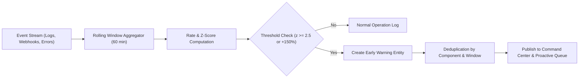

# ResolveX — Operational Anomaly Detection Engine
## Baseline Rate Comparison, Statistical Outlier Detection & Anomaly Signatures

---

### 1. STATISTICAL FORMULATION

The ResolveX Anomaly Engine continuously scans incoming event streams across payment gateways, order orchestration queues, and carrier webhooks to detect shifts prior to customer escalation.

For any component $k$ over observation window $W$ (default: 60 minutes):
- Current Error Rate: $R_{\text{current}} = \frac{E_W}{\Delta t}$ (errors per hour)
- Baseline Historical Rate: $R_{\text{baseline}}$ (30-day moving median)

#### Anomaly Thresholds
An anomaly is triggered when:
$$z = \frac{R_{\text{current}} - R_{\text{baseline}}}{\sigma_{\text{baseline}}} \ge \theta_{\text{alert}}$$

Or percentage surge:
$$\Delta R\% = \frac{R_{\text{current}} - R_{\text{baseline}}}{R_{\text{baseline}}} \times 100 \ge 150\%$$

#### Alert Severity Classification
$$\text{Alert Level} = \begin{cases}
\text{HIGH} & \text{if } \Delta R\% \ge 400\% \text{ or } z \ge 4.0 \\
\text{MEDIUM} & \text{if } 200\% \le \Delta R\% < 400\% \text{ or } 2.5 \le z < 4.0 \\
\text{LOW} & \text{if } 100\% \le \Delta R\% < 200\%
\end{cases}$$

---

### 2. DETECTION PIPELINE

