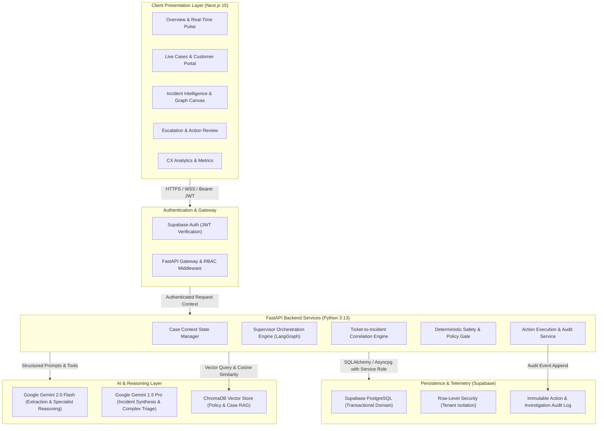

# ResolveX — Architecture Specification
## Autonomous Customer Incident Intelligence

---

### A. SYSTEM OVERVIEW

ResolveX is an enterprise-grade autonomous customer incident intelligence platform designed for modern e-commerce and subscription operations. Rather than treating customer support tickets as isolated conversations, ResolveX correlates incoming inquiries, real-time transaction telemetry, service error streams, and operational events to discover underlying systemic incidents in real time.



---

### B. FRONTEND ARCHITECTURE

1. **Framework & Language:**
   - **Next.js 15 (App Router):** Server Components for initial layout rendering and client boundary isolation.
   - **TypeScript (Strict Mode):** Absolute type safety across all components, API clients, and state stores.
   - **Tailwind CSS & shadcn/ui:** Design-token-driven enterprise design system (radix-ui primitives).

2. **Core Interactive Visualization Libraries:**
   - **React Flow (`@xyflow/react`):** Interactive graph canvas for rendering Ticket-to-Incident graphs, entity dependency trees, and agent investigation node chains.
   - **Recharts:** High-performance charting for CX impact velocity, blast radius progression, SLA timelines, and customer sentiment distribution.
   - **Lucide Icons:** Unified enterprise iconography.

3. **State Management & Data Fetching:**
   - **TanStack Query (React Query v5):** Server state caching, optimistic mutations, background polling, and cache invalidation.
   - **Zustand:** Lightweight global UI state (sidebar state, filter presets, live graph layout configuration, active drawer selection).
   - **Supabase Realtime Client:** WebSocket subscriptions for real-time ticket arrival, agent reasoning step streaming, and incident status promotions.

4. **Component Hierarchy & Layout:**
   - Root Layout (`app/layout.tsx`): Auth provider, React Query client, Toast notifications, Theme provider.
   - Dashboard Layout (`app/(dashboard)/layout.tsx`): Persistent collapsible navigation sidebar, system incident banner, quick command palette (`Cmd+K`), user profile switch.
   - Isolated View Routes:
     - `/overview`
     - `/cases` & `/cases/[id]`
     - `/incidents` & `/incidents/[id]`
     - `/investigations` & `/investigations/[id]`
     - `/customers` & `/customers/[id]`
     - `/knowledge`
     - `/agents`
     - `/escalations`
     - `/analytics`
     - `/settings`

---

### C. BACKEND ARCHITECTURE

1. **Framework & Runtime:**
   - **FastAPI (Python 3.13):** Asynchronous ASGI microservice framework.
   - **Pydantic v2:** Rigorous runtime schema validation, data serialization, and strict typing.
   - **Asyncio:** High-concurrency non-blocking I/O for concurrent multi-agent tool execution and database querying.

2. **Clean Layered Architecture:**
   ```
   FastAPI Routers (API Endpoints & HTTP Contracts)
          ↓
   Dependencies & Middleware (Auth, Tenant Injection, Rate Limiting)
          ↓
   Application Services (Case Orchestration, Incident Correlation, Action Execution)
          ↓
   Domain Models & Business Logic (Entities, Value Objects, Pure Rule Engines)
          ↓
   Infrastructure & Repositories (Supabase DB, ChromaDB, Gemini Client, Redis Cache)
   ```

3. **Dependency Injection:**
   - FastAPI `Depends()` pattern used for database sessions, current user/org context, Gemini client instances, and repository implementations to enable 100% unit test mocking.

---

### D. DATABASE ARCHITECTURE

1. **Primary Platform: Supabase PostgreSQL:**
   - Relational integrity with foreign keys, composite unique constraints, and check constraints.
   - JSONB support for unstructured service event payloads and agent reasoning logs while maintaining strictly typed relational foreign keys.

2. **Multi-Tenancy & Row-Level Security (RLS):**
   - Every tenant table carries an `org_id UUID NOT NULL REFERENCES organizations(id) ON DELETE CASCADE`.
   - RLS policies ensure that any query executing with user JWT credentials cannot read or mutate data outside their organization.
   - Backend services utilize the `SUPABASE_SERVICE_ROLE_KEY` exclusively server-side, explicitly injecting `WHERE org_id = :current_org_id` in all data-access abstraction layers.

3. **Key Relational Entities (Conceptual Schema):**
   - Detailed conceptual domain schema is defined in Section 6 and Section F of this document.

---

### E. AI ORCHESTRATION ARCHITECTURE

1. **Supervisor Engine with LangGraph:**
   - Directed acyclic graph (DAG) representing the investigation pipeline.
   - The Supervisor Agent evaluates the `CaseContext`, formulates a dynamic investigation plan, dispatches execution to specialized sub-agents, aggregates structured findings, and triggers resolution or escalation.

2. **Stateless Agents, Stateful Context:**
   - Agents are stateless functional units that receive a read-only snapshot of the `CaseContext` plus specific tool access.
   - Agents return strictly validated Pydantic finding objects that the Supervisor merges into the stateful `CaseContext`.

3. **Model Selection Strategy:**
   - **Gemini 2.0 Flash:** High-speed intent extraction, sentiment scoring, tool parameter generation, order/payment log inspection, and initial ticket clustering.
   - **Gemini 1.5 Pro / Advanced Reasoning:** Complex incident synthesis, cross-signal root cause hypothesis formulation, and postmortem draft generation.

---

### F. KNOWLEDGE & RAG ARCHITECTURE

1. **ChromaDB Vector Store:**
   - Embedded knowledge base for company refund policies, SLA guidelines, warranty terms, and historical incident postmortems.
   - Hybrid search combining dense semantic embeddings with metadata filtering (e.g., `filter={"org_id": org_id, "category": "refund_policy"}`).

2. **Chunking & Ingestion Strategy:**
   - Markdown documents chunked into 500-token passages with 100-token overlaps.
   - Embedded using Google `text-embedding-004` (768 dimensions).
   - Real-time policy re-indexing triggered via API when policies are modified in the Settings / Knowledge portal.

---

### G. INCIDENT INTELLIGENCE ARCHITECTURE

1. **Multi-Signal Correlation Pipeline:**
   Traditional clustering relies solely on semantic text similarity. ResolveX computes a multi-dimensional correlation matrix:
   - **Semantic Similarity ($S_{sem}$):** Cosine distance between ticket customer descriptions.
   - **Temporal Proximity ($S_{temp}$):** Gaussian decay over event timestamp delta ($\Delta t < 60\text{ minutes}$).
   - **Entity Overlap ($S_{ent}$):** Shared SKU, Payment Gateway ID, Fulfillment Center ID, or API route.
   - **System Telemetry Signal ($S_{tel}$):** Coinciding error spikes or deadlocks in `service_events`.

   $$\text{Correlation Score} = w_1 S_{sem} + w_2 S_{temp} + w_3 S_{ent} + w_4 S_{tel}$$

2. **Incident Lifecycle:**
   `SUSPECTED` ($\text{Score} \ge 0.65$, count $\ge 2$) $\longrightarrow$
   `EMERGING` ($\text{Score} \ge 0.75$, velocity $> 5\text{/hr}$) $\longrightarrow$
   `CONFIRMED` (Correlated service event verified, root cause identified) $\longrightarrow$
   `RESOLVED` (Remediation deployed, affected customers notified).

---

### H. RESOLUTION & ACTION ARCHITECTURE

1. **Two-Phase Action Pipeline:**
   ```
   [AI Specialist] -> Recommends: {action: "ISSUE_REFUND", amount: 49.99, reason: "Webhook failure"}
          ↓
   [Schema Validator] -> Enforces valid action parameters & entity existence
          ↓
   [Deterministic Policy Gate] -> Evaluates max refund limit ($50), customer status, idempotency key
          ↓
   [Authorization Gate] -> Checks if action requires Human Approval (amount > $50 or risky flag)
          ↓
   [Action Executor] -> Executes simulated or real API call with rollback handler
          ↓
   [Immutable Audit Log] -> Records actor, timestamp, input params, previous state, new state
   ```

2. **Zero Direct LLM Execution:**
   The AI agent CANNOT execute SQL `UPDATE` or call external financial endpoints directly. It can ONLY propose a structured `ActionRecommendation`.

---

### I. HUMAN ESCALATION ARCHITECTURE

1. **Triage & Routing:**
   - Tickets are escalated to the human queue when:
     - Confidence score falls below $0.70$.
     - Sentiment signals extreme distress or legal threats.
     - Policy engine rejects automated action due to risk boundary.
     - Root cause remains unconfirmed after specialist reasoning cycles.

2. **Contextual Handoff ("Warm Transfer"):**
   - Human operators receive an automated "Escalation Brief" generated by the Escalation Agent:
     - Executive 3-sentence summary of the customer situation.
     - Full chronology of system events and payment gateway responses.
     - Correlated systemic incident link (if any).
     - Recommended action with ready-to-click 1-tap approval buttons.

---

### J. AUTHENTICATION & AUTHORIZATION

1. **Supabase Auth as Sole Identity Provider:**
   - Email/password and session token JWTs.
   - JWT verified in FastAPI backend using Supabase public key / JWT secret.
   - NO Clerk, NO local custom auth database.

2. **Role-Based Access Control (RBAC):**
   - `customer`: Can view and submit only their own tickets and profile.
   - `support_agent`: Can view assigned tickets, execute pre-approved safe actions, escalate cases.
   - `lead_investigator`: Can manage incident declarations, trigger multi-agent investigations, approve high-value actions.
   - `admin`: Full system configuration, API key management, policy authoring.

---

### K. OBSERVABILITY & LOGGING

1. **Structured Context Logging:**
   - Every log message formatted as JSON containing `timestamp`, `level`, `trace_id`, `org_id`, `case_id`, and `agent_name`.
2. **Investigation Tracing:**
   - Each step of an autonomous investigation is persisted to the `investigation_steps` table, allowing the UI to replay agent thought steps and tool inputs/outputs.

---

### L. ERROR HANDLING & CIRCUIT BREAKERS

1. **External LLM Outage:**
   - 3-retry exponential backoff (1s, 2s, 4s).
   - If Gemini API fails completely, fallback to deterministic regex/keyword intent matcher and flag case as `AI_DEGRADED_MODE`.
2. **Database Resilience:**
   - Connection pooling with automatic reconnection.
   - Read-heavy queries separated from write operations.

---

### M. EXPLICIT ARCHITECTURAL BOUNDARIES

| Architectural Layer | Core Responsibilities | What It Must NEVER Do |
| :--- | :--- | :--- |
| **UI (Next.js)** | Rendering views, form validation, user interactions, graph visualization, displaying agent traces. | Calling LLMs directly; holding `SERVICE_ROLE_KEY`; bypassing backend validation. |
| **API Gateway (FastAPI)** | Route handling, JWT verification, rate limiting, request validation, response serialization. | Embedding raw prompt templates; running heavy synchronous calculations. |
| **Domain Services** | Case orchestration, incident correlation algorithms, ticket lifecycle state machines. | Directly querying raw database tables without repository abstractions. |
| **AI Layer (Agents)** | Unstructured text understanding, hypothesis generation, root-cause synthesis, recommendation proposals. | Mutating database directly; executing financial or shipping actions; fabricating records. |
| **Policy Engine** | Pure deterministic rules: refund amount ceilings, customer eligibility, duplicate action prevention. | Calling external third-party services; making subjective guesses. |
| **Action Executor** | Idempotent transaction execution, API dispatch, audit logging, error rollback. | Deciding *whether* an action is ethical or approved (delegated to policy gate). |
| **Data Layer (Supabase)** | Relational storage, referential integrity, tenant isolation via RLS, realtime change streaming. | Storing unhashed credentials; processing business rules outside constraints. |

---

### N. FUTURE-PHASE IMPLEMENTATION ROADMAP

- **Phase 0 (Current):** System Architecture, Domain Contracts, Specification & Environment Setup.
- **Phase 1:** Core Data Models, Supabase Schema Migrations, Synthetic Acme Commerce Seed, FastAPI Base CRUD & Auth Middleware, Next.js Base App Shell.
- **Phase 2:** Shared Case Context Runtime, Core AI Specialist Agents (Intent, Billing, Order, Policy) & LangGraph Supervisor.
- **Phase 3:** Ticket-to-Incident Intelligence Engine, Multi-Signal Correlation Matrix, Incident Graph Canvas (React Flow).
- **Phase 4:** Autonomous Resolution Engine, Safe Action Execution Pipeline, Human-in-the-Loop Escalation Center & CX Analytics Dashboard.
