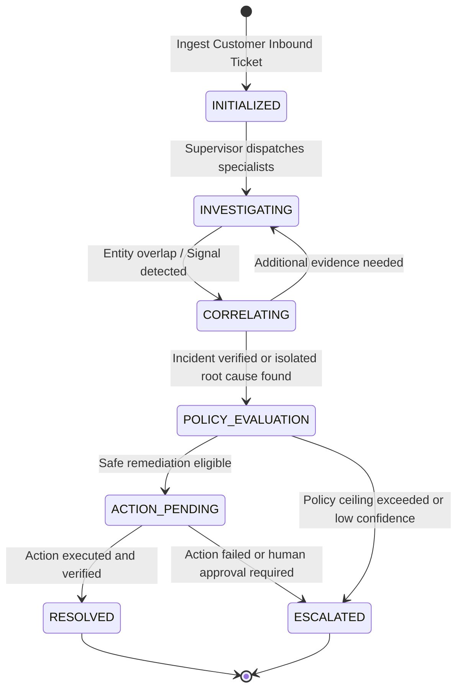

# ResolveX — Shared Case Context Contract
## Standardized State Machine & Data Schema for Autonomous Investigations

---

### 1. RATIONALE & ARCHITECTURAL CONTRACT

In multi-agent systems, agents frequently duplicate queries, hallucinate missing facts, or make contradictory deductions because each agent operates on an incomplete, fragmented view of the customer.

**The ResolveX Shared Case Context (`CaseContext`) is the single canonical source of truth for an investigation.**
- Every specialist agent receives a typed snapshot of the `CaseContext`.
- No agent is permitted to query the database or external APIs directly without recording its tool call and findings back into the `CaseContext`.
- **Zero Hallucination Rule:** Missing or unverified data must be explicitly represented as `UNAVAILABLE` or `NULL`. Agents are strictly forbidden from inferring or inventing database records.

---

### 2. CONCEPTUAL SCHEMA SPECIFICATION (Pydantic / TypeScript Model)

```typescript
export type DataAvailability<T> = 
  | { status: 'AVAILABLE'; data: T; fetched_at: string }
  | { status: 'UNAVAILABLE'; reason: string }
  | { status: 'PENDING'; requested_by_agent?: string };

export interface CaseContext {
  // --- Case Identification & Core Ticket ---
  case_id: string; // UUID of current investigation session
  ticket: TicketSummary;
  customer: CustomerSummary;
  customer_profile: DataAvailability<CustomerProfileSummary>;
  customer_history: DataAvailability<CustomerHistoricalMetrics>;
  conversation: TicketMessagePayload[];

  // --- Classification & Perception ---
  intent: IntentClassification;
  urgency: 'low' | 'medium' | 'high' | 'critical';
  sentiment: SentimentAnalysis;

  // --- Commerce & Operational Data ---
  orders: DataAvailability<OrderSummary[]>;
  payments: DataAvailability<PaymentSummary[]>;
  refunds: DataAvailability<RefundSummary[]>;
  subscriptions: DataAvailability<SubscriptionSummary[]>;
  account_state: AccountStateSummary;
  product_context: DataAvailability<ProductCatalogItem[]>;

  // --- System Telemetry & External Events ---
  service_events: DataAvailability<ServiceEventSummary[]>;
  product_events: DataAvailability<ProductEventSummary[]>;

  // --- Knowledge & Policy Grounding ---
  relevant_policies: PolicySnippet[];
  knowledge_context: KnowledgeMatch[];

  // --- Historical & Graph Correlation ---
  previous_tickets: TicketSummary[];
  related_cases: CorrelatedCaseMatch[];
  incident_candidate: IncidentCandidate | null;
  incident_evidence: EvidenceNode[];

  // --- Multi-Agent Reasoning Trail ---
  investigation_steps: InvestigationStepLog[];
  agent_findings: Record<string, SpecialistFinding>; // Keyed by Specialist Agent Name
  confidence: CalibratedConfidence;

  // --- Action & Resolution State ---
  recommended_action: ProposedAction | null;
  actions_already_attempted: AttemptedActionRecord[];
  escalation_state: EscalationHandoffState | null;
  current_state: CaseLifecycleState;
}
```

---

### 3. FIELD DEFINITIONS & TYPICAL STRUCTURES

#### `intent`
- `primary_intent`: e.g., `"payment_successful_order_missing"`, `"delayed_refund"`, `"subscription_renewal_error"`.
- `secondary_intents`: string array.
- `confidence`: float ($0.0 \le c \le 1.0$).
- `extracted_entities`: JSON dictionary (e.g., `{"transaction_id": "ch_9841", "amount": 49.99}`).

#### `sentiment`
- `polarity`: float ($-1.0$ to $+1.0$).
- `churn_risk`: `'low' | 'elevated' | 'severe'`.
- `distress_markers`: array of identified emotion keywords (e.g., `["urgent", "threatened chargeback"]`).

#### `incident_candidate`
- `incident_id`: UUID or `null` if no cluster exists yet.
- `cluster_strength`: float ($0.0$ to $1.0$).
- `common_signals`: array of shared signatures (e.g., `["gateway:stripe", "error:order_webhook_timeout"]`).
- `blast_radius_count`: integer.

#### `agent_findings`
A dictionary where each key represents a specialist agent (e.g., `"BillingAgent"`, `"OrderAgent"`, `"PolicyAgent"`) and the value contains:
```json
{
  "agent_name": "BillingAgent",
  "executed_at": "2026-09-13T14:30:05Z",
  "status": "COMPLETED",
  "confidence": 0.96,
  "deduction": "Payment ch_9841 was captured successfully at Stripe for $49.99, but no order record ORD-* matches this transaction ID.",
  "evidence_ids": ["ev_pay_9841"],
  "conflicts_detected": []
}
```

---

### 4. LIFECYCLE & STATE MACHINE



1. **`INITIALIZED`:** The ticket is received, customer profile loaded, and initial intent extraction occurs.
2. **`INVESTIGATING`:** The Supervisor invokes specialist agents (Billing, Order, Service) concurrently or sequentially based on intent.
3. **`CORRELATING`:** Incoming signals are evaluated against the Incident Correlation Matrix. If a systemic pattern matches, `incident_candidate` is populated.
4. **`POLICY_EVALUATION`:** The Resolution Agent cross-references findings against `relevant_policies` in ChromaDB and checks deterministic safety limits.
5. **`ACTION_PENDING`:** A concrete action (refund, order resend) is proposed.
6. **`RESOLVED`:** Action succeeds and customer notification is dispatched.
7. **`ESCALATED`:** Case is handed off to human support with full diagnostic brief.

---

### 5. PERSISTENCE, OWNERSHIP & UPDATE RULES

1. **State Ownership:**
   - The **Supervisor Agent Service** in FastAPI is the sole legal writer to the root `CaseContext`.
   - Specialist agents are purely functional: they take `Readonly<CaseContext>` and return an `AgentFinding` payload.
   - The Supervisor validates and merges the finding into `CaseContext.agent_findings`.

2. **Persistence Strategy:**
   - Active `CaseContext` is saved to Supabase under the `investigations` and `investigation_steps` tables at each step transition.
   - For rapid in-memory processing during a LangGraph run, the context lives in memory with checkpointing.

3. **Conflict Resolution:**
   - If two agents report contradictory findings (e.g., BillingAgent reports "Payment Refunded", while Customer says "No refund"):
     1. Ground truth from verifiable database logs overrides customer assertion.
     2. If two specialist agents disagree on facts, the Supervisor flags `confidence_degraded` and assigns an escalation reason `conflicting_system_evidence`.

4. **Evidence Attachment Protocol:**
   - Every claim in `agent_findings` must contain an array of `evidence_ids`.
   - Each evidence node specifies:
     - `evidence_id`: UUID
     - `source_table`: e.g., `payments`
     - `source_id`: e.g., `ch_stripe_9841`
     - `timestamp`: ISO timestamp
     - `hash`: SHA-256 of the raw payload to guarantee anti-tamper immutability.
