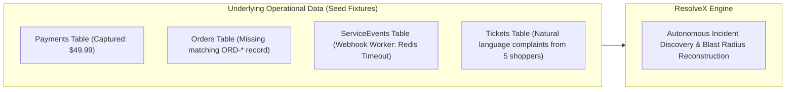

# ResolveX — Synthetic Demo Data Strategy
## Acme Commerce Simulation & Deterministic Incident Fixtures

---

### 1. FICTIONAL ENTERPRISE: ACME COMMERCE

**Organization Profile:**
- **Name:** Acme Commerce Inc.
- **Industry:** Omnichannel E-commerce & Subscription Retail.
- **Scale:** 50,000 monthly active shoppers, 1,200 orders/day, multi-gateway billing (Stripe & Razorpay), hybrid fulfillment (Warehouse East & Warehouse West).
- **Architecture:** Microservices (Storefront, Checkout Service, Payment Webhook Worker, Order Ingestion Service, Inventory Allocator, Subscription Billing Engine).

---

### 2. THREE CORE SYNTHETIC INCIDENTS (EVIDENCE-GROUNDED)

**Critical Architectural Rule:**
The database must **never** simply store a hardcoded flag `is_incident = true` on tickets. The incident correlation engine must **discover** the incident by reasoning over actual evidence patterns (error logs, payment records, timestamps, ticket text).



---

#### Incident 1 (Flagship Demo): Payment Captured But Order Creation Webhook Dropped

- **Symptom:** Customers complete checkout, credit card is charged, but no order confirmation email arrives and the order does not appear in their account order history.
- **Plausible Technical Root Cause:**
  At `2026-09-13T14:15:00Z`, the `payment-webhook-worker` experienced high Redis queue connection latency. Stripe sent `payment_intent.succeeded` webhooks, the worker returned HTTP 200 to Stripe, but failed to enqueue the event into Kafka topic `orders.create`. Consequently, payments were collected, but the `orders` database received no insert.
- **Data Footprint:**
  - **Affected Customers:** 15 total (Marcus Vance, Sarah Chen, Elena Gomez, David Kim, Priya Patel + 10 unreported).
  - **Inbound Tickets:** 5 tickets submitted over a 30-minute window expressing variations of "Money deducted but no order confirmation".
  - **Payments Table:** 15 payment records with `status = 'captured'`, `gateway_name = 'stripe'`, `amount_cents = 4999`, timestamp between `14:15:00Z` and `14:45:00Z`.
  - **Orders Table:** ZERO matching orders for these 15 payments.
  - **ServiceEvents Table:** 3 critical error logs from `payment-webhook-worker` with `event_type = 'redis_enqueue_timeout'` and `trace_id = 'tr_stripe_batch_881'`.
- **Correlation Signals:**
  - Semantic similarity of complaints $> 0.85$.
  - Exact temporal coincidence with `redis_enqueue_timeout` service events.
  - Shared gateway provider (`stripe`).

---

#### Incident 2: Delayed Bank Settlement Batch API Causing Refund Delays

- **Symptom:** Customers who returned products over 7 days ago complain that their promised refund has not appeared in their bank statement.
- **Plausible Technical Root Cause:**
  The automated nightly refund reconciliation batch job failed to execute due to an expired OAuth certificate with the banking settlement clearinghouse.
- **Data Footprint:**
  - **Affected Customers:** 8 customers across multiple product categories.
  - **Inbound Tickets:** 4 tickets ("Where is my refund?", "Return approved but no money in account").
  - **Refunds Table:** 8 records stuck in `status = 'processing'` for $> 7\text{ days}$ instead of transitioning to `completed`.
  - **ServiceEvents Table:** Nightly cron failure log: `settlement_api_handshake_error: CertificateExpiredException`.
- **Correlation Signals:**
  - Common refund status `processing` exceeding SLA window.
  - Matching cron failure timestamp in `service_events`.

---

#### Incident 3: Expired Token Refresh Rotation in Subscription Billing Vault

- **Symptom:** Long-time subscribers receive sudden "Account Suspended / Payment Failed" notices despite valid credit cards on file.
- **Plausible Technical Root Cause:**
  Payment vault token encryption key was rotated without running the legacy token migration script, causing automated subscription rebilling requests to return `invalid_card_token`.
- **Data Footprint:**
  - **Affected Customers:** 12 recurring subscribers.
  - **Inbound Tickets:** 5 tickets ("My card has plenty of balance, why was my subscription cancelled?").
  - **Subscriptions Table:** `status = 'past_due'`.
  - **Payments Table:** Batch of `status = 'failed'` with `failure_code = 'token_decryption_error'`.
  - **ServiceEvents Table:** `subscription_billing_worker: token_decryption_error`.

---

#### Control Group: Unaffected & Normal Non-Incident Traffic

To prove the intelligence engine does not generate false positives, the dataset must include realistic background noise:
- 15 normal successful orders and fulfilled shipments.
- 5 standard non-incident inquiries:
  - "How do I change my shipping address?"
  - "Do you offer international shipping to Canada?"
  - "What is your warranty policy on headphones?"
- These control tickets must remain categorized as isolated tickets and **never** be linked into an incident.

---

### 3. REPRODUCIBILITY & SEED STRATEGY

1. **Deterministic Random Seed (`seed=42`):**
   All synthetic generator scripts (using Python `Faker` and `random`) must lock the seed to `42` to guarantee identical UUIDs, customer names, timestamps, and order totals on every generation.

2. **Idempotent Reset Command:**
   A dedicated reset script (`apps/api/scripts/reset_demo_db.py`) will allow the presenter or automated test runner to restore the exact clean demo baseline in $< 3\text{ seconds}$:
   ```bash
   python -m scripts.reset_demo_db --seed=42
   ```

3. **Relative Timestamp Calculation:**
   To ensure the demo remains temporally realistic during the live presentation, timestamps will be anchored dynamically relative to `NOW()` (e.g., $T - 15\text{m}$, $T - 25\text{m}$) when seeded.
