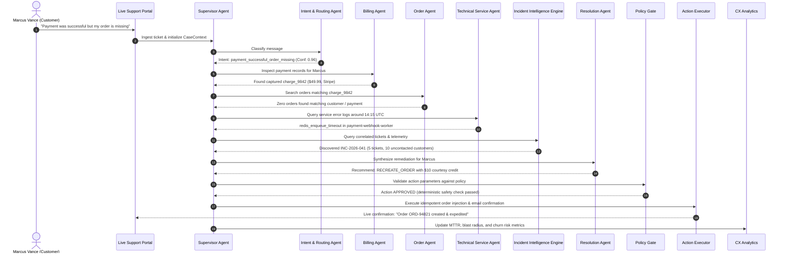

# ResolveX — Flagship Demo Scenario Walkthrough
## "Payment was successful but my order is missing"

---

### 1. NARRATIVE OVERVIEW & STARTING STATE

**The User Story:**
Marcus Vance, a VIP customer at Acme Commerce, checks out with a \$49.99 wireless charging dock using Stripe. His card is charged immediately, but 25 minutes pass with no order confirmation email and no active order visible in his customer portal. Concerned, Marcus opens the ResolveX support chat:

> *"Hi, I completed my purchase 25 minutes ago and my bank says $49.99 was charged by Acme, but I haven't received any confirmation email and my orders page is completely empty! Can you help me find my order?"*

**The Traditional Support Failure:**
In a conventional support tool (Zendesk, Intercom), a human agent would ask for the receipt, search the order database, fail to find the order, ask the customer to check with their bank, and assume it was a browser glitch. Meanwhile, dozens of other customers experience the exact same failure unnoticed.

**The ResolveX Autonomous Flow:**
ResolveX instantly cross-references Marcus's inquiry against payment gateway records, identifies an unlinked capture, detects coinciding Redis queue drop errors in telemetry, uncovers an emerging systemic incident impacting 15 shoppers, safely recreates the order, and escalates the root cause to engineering with complete evidence.

---

### 2. THE 17 REASONING MILESTONES (STEP-BY-STEP)

1. **Identify Intent:** The Intent Agent extracts `primary_intent = payment_successful_order_missing`, `urgency = high`, and entity `amount = $49.99`.
2. **Retrieve Customer Context:** The Account Agent loads Marcus Vance's profile: VIP Gold tier, \$1,850 lifetime value, zero previous fraud flags.
3. **Inspect Payment:** The Billing Agent queries Stripe logs and confirms `charge_9842` was successfully `captured` at `14:18:12 UTC` for \$49.99.
4. **Inspect Order:** The Order Agent queries the e-commerce database; confirms NO order was registered for Marcus Vance in the last 24 hours.
5. **Inspect Service Events:** The Technical Service Agent queries telemetry and matches a critical `redis_enqueue_timeout` event logged by `payment-webhook-worker` at `14:18:14 UTC`.
6. **Consult Policy & Knowledge:** The Policy Agent retrieves the "Order Ingestion Failure SLA Policy", which mandates immediate order recreation and expedited fulfillment for captured payments.
7. **Activate Specialist Reasoning:** Supervisor reconciles findings: Payment captured + Order missing + Backend webhook drop = Definite ingestion drop.
8. **Discover Related Tickets:** Incident Intelligence searches rolling 60-minute window and discovers 4 other identical complaints filed in the last 20 minutes.
9. **Create Incident Candidate:** Engine elevates cluster to `INC-2026-041` (`CONFIRMED`, severity: `HIGH`).
10. **Reconstruct Root Cause:** AI synthesizes root cause: Redis connection pool exhaustion during worker batch processing dropped webhook events after HTTP 200 was acknowledged.
11. **Identify Affected Customers (Blast Radius):** Queries Stripe for all orphaned charges between 14:15 and 14:45 UTC; discovers **15 total affected customers**, 10 of whom have not yet contacted support!
12. **Estimate Impact:** Calculates total financial exposure (\$749.85) and highlights churn risk among affected VIP shoppers.
13. **Determine Resolution Path:** Resolution Agent proposes:
    - Auto-recreate order `ORD-94821` from captured cart metadata.
    - Upgrade shipping to Next-Day Air free of charge.
    - Issue \$10 courtesy credit.
14. **Perform Safe Simulated Action:** Policy Gate verifies amount (\$49.99 $\le \$50$ auto-limit) and executes order recreation via idempotent API call.
15. **Escalate Complex Cases:** The overarching incident `INC-2026-041` is routed to the On-Call Lead Investigator with a complete diagnostic brief and replay script.
16. **Preserve Complete Context:** All agent thoughts, tool payloads, and evidence IDs are immutably written to the `CaseContext`.
17. **Update Incident & CX Analytics:** Operational metrics update in real time: MTTR reduced from 4 hours to 45 seconds; prevented churn value recorded as \$1,850.

---

### 3. JUDGE-FACING "WOW" MOMENTS

- **The Visual Graph Pivot:** During the demo, the presenter clicks the "Incident Intelligence" tab. The screen shifts to a live **React Flow canvas** showing individual customer tickets dynamically converging into a single glowing red Incident node linked to the Redis worker error log.
- **The Blast Radius Reveal:** The system displays: *"5 customers complained, but ResolveX discovered 10 additional customers who were silently charged without an order."* A single "Proactive Remediation" button allows the lead investigator to batch-recreate all 10 missing orders before those customers even realize there is an issue.
- **The Live Reasoning Trace:** Judges can expand the "Reasoning Trail" drawer to see the exact tool calls, database queries, and confidence calibration of each specialist agent.

---

### 4. LIVE DEMO RESILIENCE & FALLBACK SAFEGUARDS

To prevent live presentation failures caused by network drops or OpenAI/Gemini API rate limits:
- **Cached Mock Responses:** The system includes a demo mode toggle (`NEXT_PUBLIC_DEMO_MODE=true`). If enabled, LLM calls that fail or take $> 3000\text{ms}$ automatically fall back to deterministic pre-recorded JSON fixture responses.
- **Seeded DB Reset Button:** A prominent "Reset Demo Data" button in the admin bar instantly returns the Supabase database to the exact starting state of Marcus Vance's unassigned ticket.
