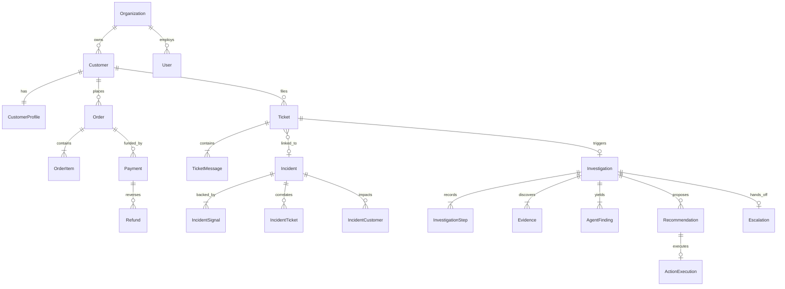

# ResolveX — Domain & Database Model Specification
## Conceptual Domain Schema & Entity Relationships

---

### 1. OVERVIEW & DESIGN PRINCIPLES

1. **Multi-Tenant Scoping:** All tenant-scoped entities include an `org_id UUID REFERENCES organizations(id) ON DELETE CASCADE`.
2. **Key Strategy:** UUIDv7 (time-ordered) or UUIDv4 for primary keys to ensure high-performance B-tree indexing across distributed nodes.
3. **Audit & Traceability:** All entities track `created_at` and `updated_at`. State-changing operational entities track `created_by` or `actor_id`.
4. **Referential Integrity:** Enforce foreign key constraints across relational entities; use strictly typed JSONB columns only for polymorphic service payloads and agent reasoning context.

---

### 2. DETAILED ENTITY DEFINITIONS

#### 2.1 Organization & Identity

##### `Organization`
- **Purpose:** Represents the tenant enterprise (e.g., Acme Commerce).
- **Primary Key:** `id UUID`
- **Important Fields:** `name VARCHAR(255) NOT NULL`, `slug VARCHAR(100) UNIQUE NOT NULL`, `tier VARCHAR(50) DEFAULT 'enterprise'`, `settings JSONB DEFAULT '{}'`
- **Timestamps:** `created_at TIMESTAMPTZ NOT NULL DEFAULT NOW()`, `updated_at TIMESTAMPTZ NOT NULL DEFAULT NOW()`
- **Indexes:** Unique index on `slug`.

##### `User`
- **Purpose:** Staff members, support agents, incident investigators, and system administrators.
- **Primary Key:** `id UUID` (mirrors Supabase `auth.users.id`)
- **Foreign Keys:** `org_id UUID NOT NULL REFERENCES organizations(id)`
- **Important Fields:** `email VARCHAR(255) NOT NULL`, `full_name VARCHAR(255) NOT NULL`, `role VARCHAR(50) NOT NULL CHECK (role IN ('customer', 'support_agent', 'lead_investigator', 'admin'))`, `is_active BOOLEAN NOT NULL DEFAULT TRUE`
- **Indexes:** Composite unique index on `(org_id, email)`.

##### `Customer`
- **Purpose:** End-users / buyers of the tenant's products.
- **Primary Key:** `id UUID`
- **Foreign Keys:** `org_id UUID NOT NULL REFERENCES organizations(id)`
- **Important Fields:** `external_customer_id VARCHAR(100)`, `email VARCHAR(255) NOT NULL`, `phone VARCHAR(50)`, `full_name VARCHAR(255) NOT NULL`, `status VARCHAR(50) DEFAULT 'active' CHECK (status IN ('active', 'blocked', 'flagged_for_fraud'))`
- **Indexes:** `(org_id, email)`, `(org_id, external_customer_id)`.

##### `CustomerProfile`
- **Purpose:** Enriched customer metadata, aggregate lifetime value, loyalty tier, and churn indicators.
- **Primary Key:** `id UUID`
- **Foreign Keys:** `org_id UUID NOT NULL REFERENCES organizations(id)`, `customer_id UUID UNIQUE NOT NULL REFERENCES customers(id) ON DELETE CASCADE`
- **Important Fields:** `lifetime_value_cents BIGINT NOT NULL DEFAULT 0`, `currency VARCHAR(3) NOT NULL DEFAULT 'USD'`, `loyalty_tier VARCHAR(50) DEFAULT 'bronze' CHECK (loyalty_tier IN ('bronze', 'silver', 'gold', 'vip'))`, `total_orders_count INT NOT NULL DEFAULT 0`, `total_tickets_count INT NOT NULL DEFAULT 0`, `churn_risk_score NUMERIC(3,2) DEFAULT 0.00`, `sentiment_trend VARCHAR(50) DEFAULT 'neutral'`

##### `CustomerInteraction`
- **Purpose:** Omnichannel log of customer contact touchpoints (chat, email, voice call transcript).
- **Primary Key:** `id UUID`
- **Foreign Keys:** `org_id UUID NOT NULL REFERENCES organizations(id)`, `customer_id UUID NOT NULL REFERENCES customers(id)`, `ticket_id UUID REFERENCES tickets(id)`
- **Important Fields:** `channel VARCHAR(50) NOT NULL CHECK (channel IN ('chat', 'email', 'phone', 'portal', 'api'))`, `direction VARCHAR(20) NOT NULL CHECK (direction IN ('inbound', 'outbound'))`, `summary TEXT`, `raw_payload JSONB DEFAULT '{}'`
- **Timestamps:** `started_at TIMESTAMPTZ NOT NULL`, `ended_at TIMESTAMPTZ`

---

#### 2.2 Support & Tickets

##### `Ticket`
- **Purpose:** The core customer issue record submitted by or created for a customer.
- **Primary Key:** `id UUID`
- **Foreign Keys:** `org_id UUID NOT NULL REFERENCES organizations(id)`, `customer_id UUID NOT NULL REFERENCES customers(id)`, `assigned_agent_id UUID REFERENCES users(id)`, `incident_id UUID REFERENCES incidents(id)`
- **Important Fields:**
  - `ticket_number VARCHAR(50) NOT NULL` (e.g., `TCK-10023`)
  - `subject VARCHAR(255) NOT NULL`
  - `status VARCHAR(50) NOT NULL DEFAULT 'open' CHECK (status IN ('open', 'investigating', 'waiting_customer', 'escalated', 'resolved', 'closed'))`
  - `priority VARCHAR(20) NOT NULL DEFAULT 'medium' CHECK (priority IN ('low', 'medium', 'high', 'urgent'))`
  - `intent_category VARCHAR(100)` (e.g., `payment_missing_order`, `refund_delay`, `subscription_fail`)
  - `sentiment_score NUMERIC(3,2) DEFAULT 0.00` (-1.0 to +1.0)
  - `is_escalated BOOLEAN NOT NULL DEFAULT FALSE`
- **Indexes:** `(org_id, status)`, `(org_id, customer_id)`, `(org_id, incident_id)`, `(org_id, priority)`.

##### `TicketMessage`
- **Purpose:** Individual chronological messages inside a ticket conversation.
- **Primary Key:** `id UUID`
- **Foreign Keys:** `org_id UUID NOT NULL REFERENCES organizations(id)`, `ticket_id UUID NOT NULL REFERENCES tickets(id) ON DELETE CASCADE`, `sender_user_id UUID REFERENCES users(id)`
- **Important Fields:**
  - `sender_type VARCHAR(20) NOT NULL CHECK (sender_type IN ('customer', 'human_agent', 'ai_assistant', 'system'))`
  - `content TEXT NOT NULL`
  - `attachments JSONB DEFAULT '[]'`
  - `metadata JSONB DEFAULT '{}'`

---

#### 2.3 Commerce & Subscriptions

##### `Product`
- **Purpose:** Catalog items sold by the tenant.
- **Primary Key:** `id UUID`
- **Foreign Keys:** `org_id UUID NOT NULL REFERENCES organizations(id)`
- **Important Fields:** `sku VARCHAR(100) NOT NULL`, `name VARCHAR(255) NOT NULL`, `category VARCHAR(100)`, `price_cents INT NOT NULL`, `is_active BOOLEAN NOT NULL DEFAULT TRUE`
- **Indexes:** Unique `(org_id, sku)`.

##### `Order`
- **Purpose:** Customer purchase transaction record.
- **Primary Key:** `id UUID`
- **Foreign Keys:** `org_id UUID NOT NULL REFERENCES organizations(id)`, `customer_id UUID NOT NULL REFERENCES customers(id)`
- **Important Fields:**
  - `order_number VARCHAR(50) NOT NULL` (e.g., `ORD-94821`)
  - `status VARCHAR(50) NOT NULL CHECK (status IN ('pending', 'processing', 'confirmed', 'shipped', 'delivered', 'cancelled', 'failed'))`
  - `total_amount_cents INT NOT NULL`
  - `currency VARCHAR(3) NOT NULL DEFAULT 'USD'`
  - `shipping_address JSONB NOT NULL`
  - `fulfillment_center_id VARCHAR(100)`
- **Indexes:** `(org_id, order_number)`, `(org_id, customer_id, created_at)`.

##### `OrderItem`
- **Purpose:** Line items within an order.
- **Primary Key:** `id UUID`
- **Foreign Keys:** `org_id UUID NOT NULL REFERENCES organizations(id)`, `order_id UUID NOT NULL REFERENCES orders(id) ON DELETE CASCADE`, `product_id UUID NOT NULL REFERENCES products(id)`
- **Important Fields:** `quantity INT NOT NULL CHECK (quantity > 0)`, `unit_price_cents INT NOT NULL`, `subtotal_cents INT NOT NULL`

##### `Payment`
- **Purpose:** Payment transaction attempt with external gateways.
- **Primary Key:** `id UUID`
- **Foreign Keys:** `org_id UUID NOT NULL REFERENCES organizations(id)`, `customer_id UUID NOT NULL REFERENCES customers(id)`, `order_id UUID REFERENCES orders(id)`
- **Important Fields:**
  - `gateway_transaction_id VARCHAR(150) NOT NULL` (e.g., `ch_stripe_984210492`)
  - `gateway_name VARCHAR(50) NOT NULL CHECK (gateway_name IN ('stripe', 'razorpay', 'paypal', 'adyen', 'mock_gateway'))`
  - `amount_cents INT NOT NULL`
  - `currency VARCHAR(3) NOT NULL DEFAULT 'USD'`
  - `status VARCHAR(50) NOT NULL CHECK (status IN ('initiated', 'authorized', 'captured', 'failed', 'refunded', 'disputed'))`
  - `failure_code VARCHAR(100)`
  - `failure_message TEXT`
  - `raw_gateway_response JSONB DEFAULT '{}'`
- **Indexes:** `(org_id, gateway_transaction_id)`, `(org_id, order_id)`.

##### `Refund`
- **Purpose:** Ledger entry for monetary reimbursement issued to a customer.
- **Primary Key:** `id UUID`
- **Foreign Keys:** `org_id UUID NOT NULL REFERENCES organizations(id)`, `payment_id UUID NOT NULL REFERENCES payments(id)`, `order_id UUID REFERENCES orders(id)`, `customer_id UUID NOT NULL REFERENCES customers(id)`, `approved_by_user_id UUID REFERENCES users(id)`
- **Important Fields:**
  - `amount_cents INT NOT NULL CHECK (amount_cents > 0)`
  - `currency VARCHAR(3) NOT NULL DEFAULT 'USD'`
  - `status VARCHAR(50) NOT NULL CHECK (status IN ('requested', 'pending_approval', 'processing', 'completed', 'failed', 'rejected'))`
  - `reason VARCHAR(255) NOT NULL`
  - `is_automated BOOLEAN NOT NULL DEFAULT FALSE`

##### `Subscription`
- **Purpose:** Recurring billing memberships.
- **Primary Key:** `id UUID`
- **Foreign Keys:** `org_id UUID NOT NULL REFERENCES organizations(id)`, `customer_id UUID NOT NULL REFERENCES customers(id)`, `product_id UUID NOT NULL REFERENCES products(id)`
- **Important Fields:**
  - `status VARCHAR(50) NOT NULL CHECK (status IN ('active', 'past_due', 'paused', 'cancelled', 'expired'))`
  - `billing_interval VARCHAR(20) NOT NULL CHECK (billing_interval IN ('monthly', 'quarterly', 'yearly'))`
  - `current_period_start TIMESTAMPTZ NOT NULL`
  - `current_period_end TIMESTAMPTZ NOT NULL`
  - `cancel_at_period_end BOOLEAN NOT NULL DEFAULT FALSE`

---

#### 2.4 Telemetry, Events & Knowledge

##### `ServiceEvent`
- **Purpose:** Real-time backend system logs, gateway webhook drops, infrastructure alerts, and microservice deadlocks.
- **Primary Key:** `id UUID`
- **Foreign Keys:** `org_id UUID NOT NULL REFERENCES organizations(id)`
- **Important Fields:**
  - `service_name VARCHAR(100) NOT NULL` (e.g., `payment-webhook-worker`, `order-router-service`, `inventory-allocator`)
  - `event_type VARCHAR(100) NOT NULL` (e.g., `webhook_delivery_timeout`, `database_lock_timeout`, `kafka_consumer_lag`)
  - `severity VARCHAR(20) NOT NULL CHECK (severity IN ('info', 'warning', 'error', 'critical'))`
  - `payload JSONB NOT NULL DEFAULT '{}'`
  - `trace_id VARCHAR(100)`
- **Indexes:** `(org_id, service_name, created_at)`, `(org_id, severity)`.

##### `ProductEvent`
- **Purpose:** Customer-facing behavioral events (cart abandonment, click errors, checkout button failures).
- **Primary Key:** `id UUID`
- **Foreign Keys:** `org_id UUID NOT NULL REFERENCES organizations(id)`, `customer_id UUID REFERENCES customers(id)`
- **Important Fields:** `session_id VARCHAR(100)`, `event_name VARCHAR(100) NOT NULL`, `page_url TEXT`, `properties JSONB DEFAULT '{}'`

##### `PolicyDocument`
- **Purpose:** Enterprise guidelines for refunds, replacement terms, customer compensations, and SLA rules.
- **Primary Key:** `id UUID`
- **Foreign Keys:** `org_id UUID NOT NULL REFERENCES organizations(id)`
- **Important Fields:**
  - `title VARCHAR(255) NOT NULL`
  - `category VARCHAR(100) NOT NULL CHECK (category IN ('refund', 'shipping', 'warranty', 'cancellation', 'escalation'))`
  - `content_markdown TEXT NOT NULL`
  - `version INT NOT NULL DEFAULT 1`
  - `is_active BOOLEAN NOT NULL DEFAULT TRUE`

##### `KnowledgeSource`
- **Purpose:** Metadata registry for indexed vector chunks stored in ChromaDB.
- **Primary Key:** `id UUID`
- **Foreign Keys:** `org_id UUID NOT NULL REFERENCES organizations(id)`, `policy_id UUID REFERENCES policy_documents(id)`
- **Important Fields:** `source_type VARCHAR(50) NOT NULL`, `title VARCHAR(255) NOT NULL`, `chroma_collection_name VARCHAR(100) NOT NULL`, `total_chunks INT NOT NULL DEFAULT 0`, `last_synced_at TIMESTAMPTZ`

---

#### 2.5 Incident Intelligence & Correlation

##### `Incident`
- **Purpose:** Systemic operational incident discovered by correlating disparate tickets and signals.
- **Primary Key:** `id UUID`
- **Foreign Keys:** `org_id UUID NOT NULL REFERENCES organizations(id)`, `lead_investigator_id UUID REFERENCES users(id)`
- **Important Fields:**
  - `incident_number VARCHAR(50) NOT NULL` (e.g., `INC-2026-041`)
  - `title VARCHAR(255) NOT NULL`
  - `status VARCHAR(50) NOT NULL CHECK (status IN ('suspected', 'emerging', 'confirmed', 'resolved', 'dismissed'))`
  - `severity VARCHAR(20) NOT NULL CHECK (severity IN ('low', 'medium', 'high', 'critical'))`
  - `root_cause_hypothesis TEXT`
  - `confidence_score NUMERIC(3,2) NOT NULL DEFAULT 0.00`
  - `impact_estimate_customers INT NOT NULL DEFAULT 0`
  - `financial_exposure_cents BIGINT NOT NULL DEFAULT 0`
  - `detected_at TIMESTAMPTZ NOT NULL DEFAULT NOW()`
  - `resolved_at TIMESTAMPTZ`
- **Indexes:** `(org_id, status)`, `(org_id, severity)`.

##### `IncidentSignal`
- **Purpose:** Individual correlation evidence links (e.g., recurring error pattern, payment gateway spike).
- **Primary Key:** `id UUID`
- **Foreign Keys:** `org_id UUID NOT NULL REFERENCES organizations(id)`, `incident_id UUID NOT NULL REFERENCES incidents(id) ON DELETE CASCADE`, `service_event_id UUID REFERENCES service_events(id)`
- **Important Fields:**
  - `signal_type VARCHAR(50) NOT NULL CHECK (signal_type IN ('semantic_cluster', 'temporal_spike', 'service_error_match', 'entity_collision'))`
  - `strength_score NUMERIC(3,2) NOT NULL`
  - `description TEXT NOT NULL`
  - `metadata JSONB DEFAULT '{}'`

##### `IncidentTicket`
- **Purpose:** Many-to-many relationship linking customer tickets to an incident.
- **Primary Key:** `id UUID`
- **Foreign Keys:** `org_id UUID NOT NULL REFERENCES organizations(id)`, `incident_id UUID NOT NULL REFERENCES incidents(id) ON DELETE CASCADE`, `ticket_id UUID NOT NULL REFERENCES tickets(id) ON DELETE CASCADE`
- **Important Fields:** `correlation_score NUMERIC(3,2) NOT NULL`, `relevance_reason TEXT`, `linked_at TIMESTAMPTZ NOT NULL DEFAULT NOW()`
- **Indexes:** Unique `(incident_id, ticket_id)`.

##### `IncidentCustomer`
- **Purpose:** Registry of all affected customers within an incident's blast radius.
- **Primary Key:** `id UUID`
- **Foreign Keys:** `org_id UUID NOT NULL REFERENCES organizations(id)`, `incident_id UUID NOT NULL REFERENCES incidents(id) ON DELETE CASCADE`, `customer_id UUID NOT NULL REFERENCES customers(id)`
- **Important Fields:** `has_reported_ticket BOOLEAN NOT NULL DEFAULT FALSE`, `proactive_outreach_status VARCHAR(50) DEFAULT 'none' CHECK (proactive_outreach_status IN ('none', 'queued', 'sent', 'acknowledged'))`
- **Indexes:** Unique `(incident_id, customer_id)`.

---

#### 2.6 Autonomous Investigation & Reasoning

##### `Investigation`
- **Purpose:** Autonomous diagnostic investigation run launched for a ticket or incident candidate.
- **Primary Key:** `id UUID`
- **Foreign Keys:** `org_id UUID NOT NULL REFERENCES organizations(id)`, `ticket_id UUID NOT NULL REFERENCES tickets(id)`, `incident_id UUID REFERENCES incidents(id)`
- **Important Fields:**
  - `status VARCHAR(50) NOT NULL CHECK (status IN ('active', 'completed', 'failed', 'paused_for_human'))`
  - `summary TEXT`
  - `overall_confidence NUMERIC(3,2) DEFAULT 0.00`
  - `started_at TIMESTAMPTZ NOT NULL DEFAULT NOW()`
  - `completed_at TIMESTAMPTZ`

##### `InvestigationStep`
- **Purpose:** Discrete chronological reasoning actions executed by sub-agents.
- **Primary Key:** `id UUID`
- **Foreign Keys:** `org_id UUID NOT NULL REFERENCES organizations(id)`, `investigation_id UUID NOT NULL REFERENCES investigations(id) ON DELETE CASCADE`
- **Important Fields:**
  - `step_number INT NOT NULL`
  - `agent_name VARCHAR(100) NOT NULL` (e.g., `SupervisorAgent`, `BillingAgent`, `OrderAgent`)
  - `action_type VARCHAR(100) NOT NULL` (e.g., `inspect_payment_gateway`, `search_policies`, `query_service_events`)
  - `thought_process TEXT`
  - `tool_name VARCHAR(100)`
  - `tool_input JSONB DEFAULT '{}'`
  - `tool_output JSONB DEFAULT '{}'`
  - `duration_ms INT`

##### `Evidence`
- **Purpose:** Concrete immutable facts discovered during investigation that ground AI conclusions.
- **Primary Key:** `id UUID`
- **Foreign Keys:** `org_id UUID NOT NULL REFERENCES organizations(id)`, `investigation_id UUID NOT NULL REFERENCES investigations(id) ON DELETE CASCADE`
- **Important Fields:**
  - `evidence_type VARCHAR(50) NOT NULL CHECK (evidence_type IN ('payment_record', 'order_log', 'service_event', 'policy_rule', 'customer_profile'))`
  - `source_entity_id VARCHAR(100) NOT NULL`
  - `summary TEXT NOT NULL`
  - `raw_data JSONB NOT NULL DEFAULT '{}'`
  - `relevance_score NUMERIC(3,2) NOT NULL`

##### `Agent`
- **Purpose:** Registry of specialized AI agents configured in the system.
- **Primary Key:** `id UUID`
- **Important Fields:** `name VARCHAR(100) UNIQUE NOT NULL`, `role_description TEXT NOT NULL`, `model_name VARCHAR(100) NOT NULL`, `is_active BOOLEAN NOT NULL DEFAULT TRUE`

##### `AgentRun`
- **Purpose:** Execution run of an agent within a case investigation.
- **Primary Key:** `id UUID`
- **Foreign Keys:** `org_id UUID NOT NULL REFERENCES organizations(id)`, `investigation_id UUID NOT NULL REFERENCES investigations(id)`, `agent_id UUID NOT NULL REFERENCES agents(id)`
- **Important Fields:** `input_state_hash VARCHAR(64) NOT NULL`, `tokens_used INT DEFAULT 0`, `duration_ms INT`, `status VARCHAR(50) NOT NULL`

##### `AgentFinding`
- **Purpose:** Structured deduction emitted by a specialist agent.
- **Primary Key:** `id UUID`
- **Foreign Keys:** `org_id UUID NOT NULL REFERENCES organizations(id)`, `investigation_id UUID NOT NULL REFERENCES investigations(id) ON DELETE CASCADE`, `agent_run_id UUID REFERENCES agent_runs(id)`
- **Important Fields:**
  - `finding_type VARCHAR(100) NOT NULL` (e.g., `unlinked_captured_payment`, `webhook_drop_confirmed`)
  - `conclusion TEXT NOT NULL`
  - `confidence NUMERIC(3,2) NOT NULL`
  - `evidence_refs JSONB NOT NULL DEFAULT '[]'` (array of `evidence.id`)

---

#### 2.7 Actions, Execution & Safety

##### `Recommendation`
- **Purpose:** Formal action proposed by the AI reasoning engine.
- **Primary Key:** `id UUID`
- **Foreign Keys:** `org_id UUID NOT NULL REFERENCES organizations(id)`, `investigation_id UUID NOT NULL REFERENCES investigations(id)`, `ticket_id UUID NOT NULL REFERENCES tickets(id)`
- **Important Fields:**
  - `action_type VARCHAR(100) NOT NULL CHECK (action_type IN ('recreate_order', 'issue_refund', 'apply_courtesy_credit', 'resend_webhook', 'escalate_human'))`
  - `parameters JSONB NOT NULL DEFAULT '{}'`
  - `justification TEXT NOT NULL`
  - `estimated_risk VARCHAR(20) NOT NULL CHECK (estimated_risk IN ('low', 'medium', 'high'))`
  - `requires_human_approval BOOLEAN NOT NULL DEFAULT FALSE`
  - `status VARCHAR(50) NOT NULL DEFAULT 'proposed' CHECK (status IN ('proposed', 'approved', 'rejected', 'executed'))`

##### `Action`
- **Purpose:** Catalog of permitted system actions with associated safety boundaries.
- **Primary Key:** `id UUID`
- **Important Fields:** `action_key VARCHAR(100) UNIQUE NOT NULL`, `description TEXT`, `max_financial_limit_cents INT DEFAULT 0`, `is_reversible BOOLEAN NOT NULL DEFAULT FALSE`

##### `ActionExecution`
- **Purpose:** Immutable audit record of an executed action.
- **Primary Key:** `id UUID`
- **Foreign Keys:** `org_id UUID NOT NULL REFERENCES organizations(id)`, `recommendation_id UUID NOT NULL REFERENCES recommendations(id)`, `ticket_id UUID NOT NULL REFERENCES tickets(id)`, `executed_by_user_id UUID REFERENCES users(id)`
- **Important Fields:**
  - `execution_status VARCHAR(50) NOT NULL CHECK (execution_status IN ('success', 'failed', 'rolled_back'))`
  - `idempotency_key VARCHAR(100) UNIQUE NOT NULL`
  - `payload_sent JSONB NOT NULL`
  - `response_received JSONB NOT NULL`
  - `executed_at TIMESTAMPTZ NOT NULL DEFAULT NOW()`

---

#### 2.8 Human Escalation & Governance

##### `Escalation`
- **Purpose:** Case handoff to human support queue when autonomy boundary is reached.
- **Primary Key:** `id UUID`
- **Foreign Keys:** `org_id UUID NOT NULL REFERENCES organizations(id)`, `ticket_id UUID NOT NULL REFERENCES tickets(id) ON DELETE CASCADE`, `investigation_id UUID NOT NULL REFERENCES investigations(id)`, `assigned_to_user_id UUID REFERENCES users(id)`
- **Important Fields:**
  - `escalation_reason VARCHAR(100) NOT NULL CHECK (escalation_reason IN ('policy_limit_exceeded', 'low_confidence', 'high_sentiment_distress', 'unconfirmed_incident', 'customer_request'))`
  - `executive_summary TEXT NOT NULL`
  - `recommended_resolution TEXT`
  - `urgency VARCHAR(20) NOT NULL CHECK (urgency IN ('normal', 'urgent', 'critical'))`
  - `status VARCHAR(50) NOT NULL DEFAULT 'pending' CHECK (status IN ('pending', 'in_review', 'resolved'))`

##### `EscalationEvent`
- **Purpose:** Lifecycle timeline of human intervention (agent assigned, note added, resolution accepted).
- **Primary Key:** `id UUID`
- **Foreign Keys:** `org_id UUID NOT NULL REFERENCES organizations(id)`, `escalation_id UUID NOT NULL REFERENCES escalations(id) ON DELETE CASCADE`, `user_id UUID NOT NULL REFERENCES users(id)`
- **Important Fields:** `event_type VARCHAR(50) NOT NULL`, `note TEXT`, `created_at TIMESTAMPTZ NOT NULL DEFAULT NOW()`

##### `Notification`
- **Purpose:** System notifications to internal staff and external customers.
- **Primary Key:** `id UUID`
- **Foreign Keys:** `org_id UUID NOT NULL REFERENCES organizations(id)`, `recipient_user_id UUID REFERENCES users(id)`, `customer_id UUID REFERENCES customers(id)`
- **Important Fields:** `title VARCHAR(255) NOT NULL`, `body TEXT NOT NULL`, `channel VARCHAR(50) NOT NULL`, `status VARCHAR(50) DEFAULT 'unread'`

---

#### 2.9 CX Analytics & Churn Prediction

##### `CXMetric`
- **Purpose:** Aggregated operational metrics for business health reporting.
- **Primary Key:** `id UUID`
- **Foreign Keys:** `org_id UUID NOT NULL REFERENCES organizations(id)`
- **Important Fields:**
  - `metric_date DATE NOT NULL`
  - `total_cases INT NOT NULL DEFAULT 0`
  - `autonomous_resolutions INT NOT NULL DEFAULT 0`
  - `human_escalations INT NOT NULL DEFAULT 0`
  - `average_resolution_time_seconds INT NOT NULL DEFAULT 0`
  - `incidents_detected INT NOT NULL DEFAULT 0`
  - `csat_score NUMERIC(3,2) DEFAULT 0.00`
- **Indexes:** Unique `(org_id, metric_date)`.

##### `ChurnSignal`
- **Purpose:** Customer retention risk prediction generated from ticket distress and incident exposure.
- **Primary Key:** `id UUID`
- **Foreign Keys:** `org_id UUID NOT NULL REFERENCES organizations(id)`, `customer_id UUID NOT NULL REFERENCES customers(id)`, `incident_id UUID REFERENCES incidents(id)`
- **Important Fields:**
  - `risk_score NUMERIC(3,2) NOT NULL` (0.0 to 1.0)
  - `primary_driver VARCHAR(100) NOT NULL` (e.g., `unresolved_payment_delay`, `repeated_order_failure`)
  - `suggested_retention_action TEXT`

---

### 3. CORE RELATIONSHIP MAP

