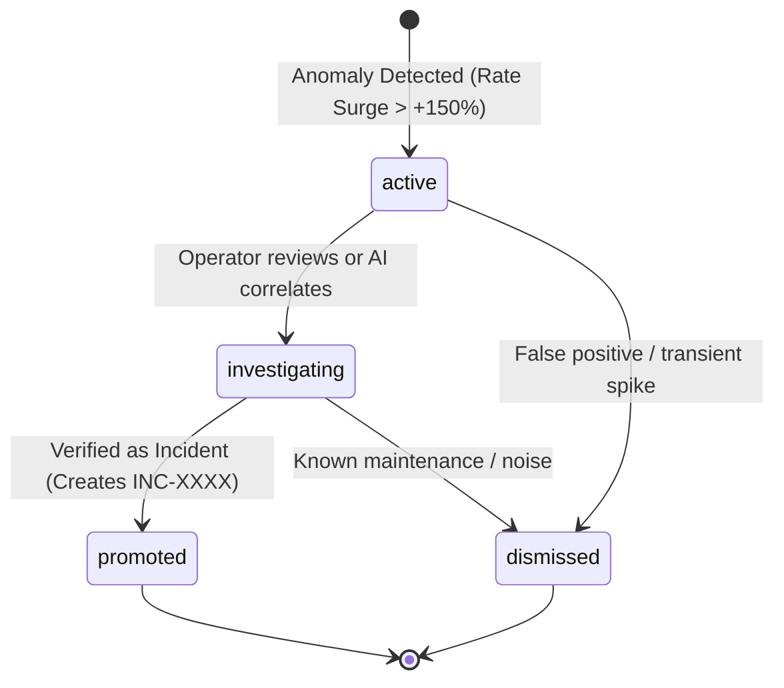

# ResolveX — Early Warning Entity Lifecycle & Promotion
## Autonomous Alert Triage, Incident Promotion & Operator Oversight

---

### 1. ENTITY STATE MACHINE

Early Warning entities represent high-risk operational anomalies that precede formal support ticket surges.

### 2. DATA CONTRACT (`EarlyWarningSchema`)

| Field | Type | Description |
| :--- | :--- | :--- |
| `id` | `UUID` | Primary key identifier |
| `component` | `String` | Impacted subsystem (`payment_gateway`, `inventory_sync`, `webhook_worker`) |
| `alert_level` | `Enum` | `low`, `medium`, `high` |
| `metric_name` | `String` | Monitored operational metric (e.g. `webhook_timeout_rate`) |
| `baseline_rate` | `Float` | Historical normal error rate per hour |
| `current_rate` | `Float` | Detected error rate per hour during anomaly window |
| `rate_increase_percentage` | `Float` | Relative surge percentage ($+600.0\%$) |
| `signal_count` | `Integer` | Number of corroborating failure events |
| `time_window_minutes` | `Integer` | Duration of evaluated window |
| `summary` | `String` | Operational summary with evidence context |
| `status` | `Enum` | `active`, `investigating`, `promoted`, `dismissed` |
| `incident_id` | `Optional[UUID]` | Linked incident ID when promoted |

---

### 3. OPERATOR INTERACTION & API ACTIONS

- `GET /api/v1/early-warnings`: Retrieve all active and triaged warnings.
- `POST /api/v1/incidents/detect-emerging`: Trigger on-demand anomaly detection sweep.
- `POST /api/v1/early-warnings/{id}/investigate`: Promote anomaly to full incident investigation.
- `POST /api/v1/early-warnings/{id}/dismiss`: Dismiss transient or expected maintenance alerts.
