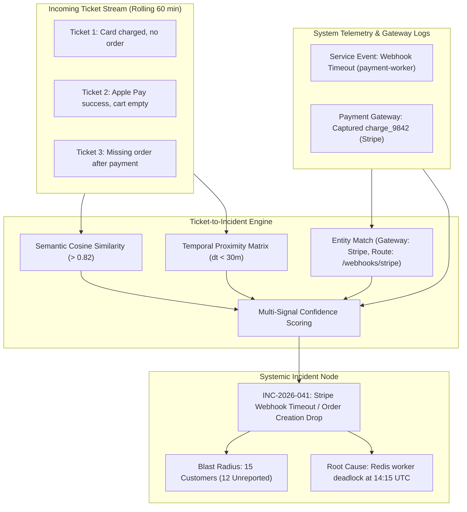
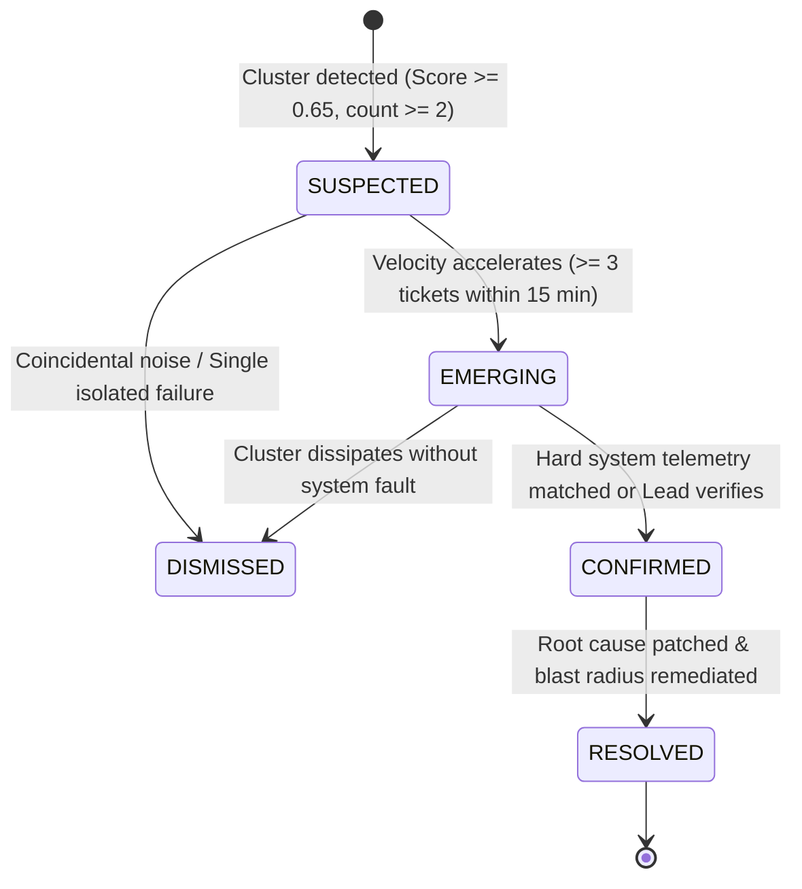

# ResolveX — Ticket-to-Incident Intelligence Engine
## Multi-Signal Correlation, Blast Radius Detection & Root Cause Synthesis

---

### 1. THE CORE INNOVATION

Traditional support systems treat tickets in silos. When an infrastructure service degrades (e.g., Redis queue backlog, banking gateway rate limit, shipping warehouse scanner outage), customer support is flooded with hundreds of apparently distinct tickets:
- *"My card was charged but I never got an order confirmation."*
- *"Where is my receipt? Payment went through on Apple Pay."*
- *"Order status still says pending after 2 hours."*

Human agents answer each inquiry one by one. By the time engineering recognizes the outage, hours have passed, hundreds of customers are infuriated, and support backlogs take days to clear.

**ResolveX Ticket-to-Incident Intelligence automates this discovery in real time:**
It synthesizes customer text semantics, transactional metadata, temporal proximity, and backend system telemetry into a cohesive **Incident Evidence Graph**.



---

### 2. MULTI-SIGNAL CORRELATION MATHEMATICAL FORMULATION

Rather than simplistic keyword matching, ResolveX evaluates a composite multi-signal score $C_{ij}$ between ticket $i$ and ticket $j$ (or between ticket $i$ and incident candidate $I$):

$$C_{ij} = w_{sem} \cdot S_{sem}(i,j) + w_{temp} \cdot S_{temp}(i,j) + w_{ent} \cdot S_{ent}(i,j) + w_{tel} \cdot S_{tel}(i,j)$$

Where weights sum to $1.0$:
- $w_{sem} = 0.25$ (Semantic textual similarity via Gemini embeddings)
- $w_{temp} = 0.20$ (Temporal decay window)
- $w_{ent} = 0.25$ (Shared entity identifiers: SKU, Payment Gateway, Route)
- $w_{tel} = 0.30$ (Direct correlation with verified backend service error events)

#### Component Details:

1. **Semantic Similarity ($S_{sem}$):**
   Cosine similarity of embedding vectors generated by `text-embedding-004`:
   $$S_{sem} = \frac{\vec{e}_i \cdot \vec{e}_j}{\|\vec{e}_i\| \|\vec{e}_j\|}$$

2. **Temporal Proximity ($S_{temp}$):**
   Exponential decay based on time delta between ticket creation:
   $$S_{temp} = \exp\left(-\frac{|t_i - t_j|}{\tau}\right) \quad (\tau = 3600\text{ seconds})$$

3. **Shared Entity Overlap ($S_{ent}$):**
   Jaccard similarity across discrete categorical entities (Payment Gateway name, Product SKU, Carrier name, Warehouse ID):
   $$S_{ent} = \frac{|\text{Entities}_i \cap \text{Entities}_j|}{|\text{Entities}_i \cup \text{Entities}_j|}$$

4. **Telemetry & Service Event Correlation ($S_{tel}$):**
   Binary/probabilistic indicator of whether a critical `service_event` occurred within $[t_i - 15\text{m}, t_i + 5\text{m}]$ matching the transaction type.

---

### 3. EVIDENCE HIERARCHY & CONFIDENCE CALIBRATION

Not every surge of tickets is a true operational incident. ResolveX stratifies evidence into three tiers to avoid false-positive alerts:

| Evidence Tier | Evidence Types | Weight | Description |
| :--- | :--- | :--- | :--- |
| **Tier 1: Hard Evidence** | `service_events` with 5xx errors, Gateway Webhook dropped event, Database deadlock trace, Redis queue lag spike. | **High (0.90 - 1.00)** | Concrete system telemetry proving technical failure. Automatically validates incident if $\ge 2$ tickets coincide. |
| **Tier 2: Medium Evidence** | Exact same product SKU stock depletion, same payment gateway provider with timeout status, identical transaction timestamp window. | **Medium (0.70 - 0.85)** | High circumstantial probability; requires at least 3 tickets to form candidate. |
| **Tier 3: Soft Evidence** | Vague semantic complaints ("app is slow", "something went wrong", "help me"). | **Low (0.30 - 0.50)** | Inconclusive on its own; cannot declare an incident without Tier 1 or Tier 2 corroboration. |

---

### 4. INCIDENT LIFECYCLE & STATE MACHINE



1. **`SUSPECTED`:** Initial detection when 2 tickets show strong semantic and temporal correlation. System begins background scanning of telemetry.
2. **`EMERGING`:** Ticket velocity exceeds threshold ($> 3$ tickets in 15 minutes) or a Tier 2 entity overlap is confirmed. Incident candidate is displayed on the investigator dashboard with amber status.
3. **`CONFIRMED`:** A Tier 1 `service_event` is matched to the cluster or a Lead Investigator manually confirms the incident. Proactive blast radius calculation is launched.
4. **`RESOLVED`:** Engineering deploys fix; automated batch remediation (e.g., re-running dropped webhooks) is executed; affected tickets are reconciled.
5. **`DISMISSED`:** False alarm or unrelated concurrent issues; tickets return to independent queues.

---

### 5. INPUT & OUTPUT CONTRACTS

#### Engine Input:
```json
{
  "new_ticket": {
    "id": "tck_10023",
    "subject": "Payment successful but no order received",
    "content": "I paid $49.99 via Stripe 10 minutes ago, card was charged, but order is missing.",
    "created_at": "2026-09-13T14:25:00Z",
    "customer_id": "cust_4821",
    "extracted_entities": {
      "gateway": "stripe",
      "amount": 49.99
    }
  },
  "rolling_window_tickets": ["..."],
  "recent_service_events": [
    {
      "id": "evt_9912",
      "service_name": "payment-webhook-worker",
      "event_type": "webhook_delivery_timeout",
      "severity": "critical",
      "timestamp": "2026-09-13T14:15:22Z",
      "payload": {"gateway": "stripe", "error": "Redis lock contention timeout"}
    }
  ]
}
```

#### Engine Output (Structured Pydantic Model):
```json
{
  "incident_candidate": {
    "status": "CONFIRMED",
    "incident_number": "INC-2026-041",
    "title": "Stripe Webhook Delivery Timeout causing Order Ingestion Desync",
    "confidence_score": 0.94,
    "severity": "high",
    "root_cause_hypothesis": "The payment-webhook-worker experienced Redis connection pool exhaustion at 14:15 UTC, resulting in 200 OK sent to Stripe but failed enqueue to the order-creation pipeline.",
    "supporting_signals": [
      {
        "signal_type": "service_error_match",
        "evidence_id": "evt_9912",
        "description": "Critical webhook delivery timeout in payment-webhook-worker."
      },
      {
        "signal_type": "semantic_cluster",
        "description": "5 tickets reporting payment success with missing orders."
      }
    ],
    "linked_ticket_ids": ["tck_10021", "tck_10023", "tck_10025", "tck_10028", "tck_10031"],
    "blast_radius": {
      "reported_customers_count": 5,
      "unreported_affected_customers_count": 10,
      "total_affected_customers": 15,
      "total_financial_exposure_cents": 74985
    },
    "recommended_incident_action": "RETRY_WEBHOOK_BATCH_REPROCESS"
  }
}
```
