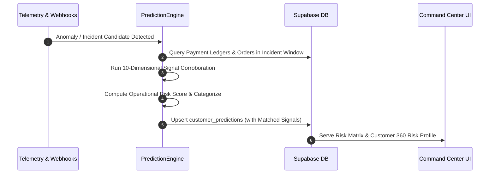

# ResolveX — Customer Impact Prediction & Evidence Corroboration Engine
## Pre-Ticket Blast Radius Discovery & Multi-Signal Operational Risk Scoring

---

### 1. CORE PHILOSOPHY & NON-NEGOTIABLES

1. **Prediction is NOT Certainty:**
   - Predictions are explicitly designated as *"Likely affected based on [Signals]"*, never *"will be affected"*.
   - Every prediction output exposes:
     - `classification`: `CONFIRMED_AFFECTED`, `LIKELY_AFFECTED`, `POTENTIALLY_AFFECTED`, `NOT_AFFECTED`
     - `confidence_score`: $0.0 \le c \le 1.0$ (calibrated against matched signal density)
     - `operational_risk_score`: $0 \le S \le 100$ (normalized multi-attribute risk)
     - `operational_risk_level`: `LOW`, `MEDIUM`, `HIGH`, `CRITICAL`
     - `matched_signals` and `missing_signals`: Concrete entity IDs and log events
     - `observed_facts`: Ground truth facts (e.g., successful payment, order unfulfilled)
     - `predicted_impact`: Explicit consequences if left unaddressed
     - `prediction_reason`: Human-readable and machine-auditable justification
     - `prediction_method`: Exact heuristic / pattern matcher / ML model version

2. **No Sensitive-Attribute Profiling:**
   - Prioritization and risk scoring rely strictly on legitimate operational attributes:
     - Incident Severity ($w_{\text{sev}}$)
     - Direct Financial Exposure / Transaction Value ($w_{\text{val}}$)
     - Temporal Proximity & Time Window ($w_{\text{time}}$)
     - Order Fulfillment State ($w_{\text{ord}}$)
     - Customer Loyalty Tier ($w_{\text{tier}}$)
     - Support Velocity / Repeat Complaints ($w_{\text{rep}}$)

3. **Multi-Signal Corroboration (10 Evidence Dimensions):**
   - Candidate discovery does not rely on a single vague keyword. It corroborates signals across:
     - `gateway_success`: Payment gateway captured charges without refund.
     - `order_creation_failed`: E-commerce orders missing corresponding to captured payment.
     - `webhook_delivery_failure`: Explicit webhook 504 / timeout in payment processor logs.
     - `inventory_decrement_absent`: WMS inventory records showing zero allocation.
     - `carrier_tracking_missing`: Carrier fulfillment APIs showing no tracking generation.
     - `temporal_window_overlap`: Activity occurring inside the incident failure window.
     - `customer_complaint_match`: Semantic match with incoming customer tickets.
     - `repeat_failed_attempts`: Retried checkout attempts by the same customer.
     - `service_trace_error`: Correlation with microservice distributed tracing spans.
     - `high_value_customer_exposure`: Enterprise / Gold / Platinum tier financial exposure.

---

### 2. MATHEMATICAL SCORING FORMULATION

For any candidate customer $c$ in incident $I$, the operational risk score $R(c, I) \in [0, 100]$ is computed as:

$$R(c, I) = 100 \times \min\left(1.0, \, w_{\text{sev}} S_I + w_{\text{val}} V_c + w_{\text{time}} T_c + w_{\text{ord}} O_c + w_{\text{tier}} L_c + w_{\text{rep}} N_c\right)$$

Where:
- $S_I \in [0, 1]$ is the incident severity factor (Critical = 1.0, High = 0.8, Medium = 0.5, Low = 0.2).
- $V_c = \min(1.0, \frac{\text{exposure\_cents}}{50000})$ is the normalized financial exposure (capped at \$500.00).
- $T_c = \exp\left(-\frac{\Delta t}{2 \times \tau_{\text{window}}}\right)$ is the temporal decay factor.
- $O_c = 1.0$ if payment succeeded without order creation, $0.5$ if order stuck in `pending_payment`, $0.0$ if fulfilled.
- $L_c \in \{0.3, 0.5, 0.8, 1.0\}$ represents the customer tier (Standard, Bronze, Silver, Enterprise/Platinum).
- $N_c = \min(1.0, \frac{\text{ticket\_count}}{3})$ is the repeat ticket factor.

The calibrated weights satisfy $\sum w = 1.0$:
$$w_{\text{sev}} = 0.25, \quad w_{\text{val}} = 0.25, \quad w_{\text{time}} = 0.15, \quad w_{\text{ord}} = 0.20, \quad w_{\text{tier}} = 0.10, \quad w_{\text{rep}} = 0.05$$

#### Risk Tier Thresholds
$$\text{Risk Level} = \begin{cases}
\text{CRITICAL} & \text{if } R \ge 85 \\
\text{HIGH} & \text{if } 70 \le R < 85 \\
\text{MEDIUM} & \text{if } 40 \le R < 70 \\
\text{LOW} & \text{if } R < 40
\end{cases}$$

---

### 3. EVIDENCE CORROBORATION LIFECYCLE

