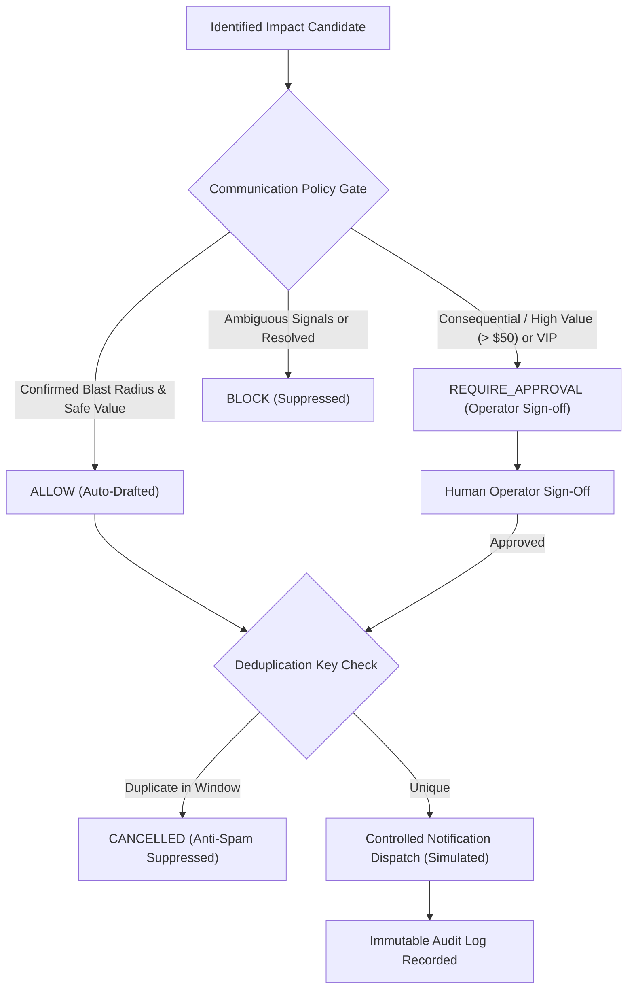

# ResolveX — Proactive Customer Support & Communication Policy Gates
## Anti-Spam Deduplication, Consequential Safety Gates & Controlled Notification Dispatch

---

### 1. PHILOSOPHY OF SAFE PROACTIVE SUPPORT

Proactive customer communication is a double-edged sword:
- Done right: Eliminates customer anxiety, prevents duplicate ticket storms, and builds trust.
- Done carelessly: Spams unimpacted customers, alarms users unnecessarily, and creates reputational damage.

**ResolveX enforces strict policy guardrails:**

---

### 2. DEDUPLICATION KEY CONTRACT

To prevent multiple alerts to the same user during incident flapping:

$$\text{Deduplication Key} = \text{MD5}(\text{incident\_id} + \text{customer\_id} + \text{notification\_type})$$

Any subsequent recommendation matching an existing record with status `DRAFTED`, `APPROVED`, or `SENT` is automatically suppressed.

---

### 3. COMMUNICATION LIFECYCLE STATES

- `DRAFTED`: Outreach recommendation generated and passed policy criteria.
- `APPROVED`: Authorized by human operator (mandatory for consequential or high-value cases).
- `SENT`: Dispatched via simulated channel (Email, SMS, Portal Banner) and verified.
- `FAILED`: Channel error or dispatch timeout.
- `CANCELLED`: Suppressed by anti-spam deduplication or dismissed by operator.
